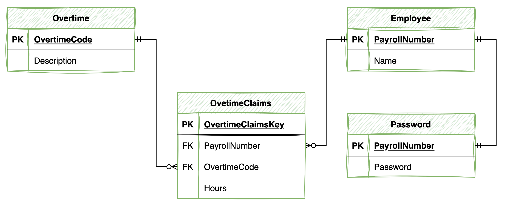

# COM519 - Advanced Databases

<u>Hosted Application: </u> 

<u>Git Repository: </u>https://github.com/AmeChops/COM519.git

</u>User Name: </u> 1800100 

</u>Password: </u> greenbanana 

## Introduction

Within Hampshire & Isle of Wight Fire and Rescue Service there is currently no auotmated process for claiming overtime.  These are currently recorded using paper forms and spreadsheets.  This can casue delays to claims and increases possibilties for errors due to manual intervention.  This web application should provide a more robust way of claiming making it quicker and less prone to errors caused by manual intervention.

## System Overview

Employees will login with their user name, this will be their Payroll Number.  For the purpose of this application I have only loaded one employee which is 1800100. 

The system will allow employees to create overtime claims, view previous claims, update previous claims and deleted previous claims.  

## Key Design Decisions

## Database Design

The database consists of 4 tables; Employee, Overtime, Password and Overtime Claims.

- The Employee table hold information relating to employees.
- The Overtime table holds information relating to overtime codes.
- The Password table holds the login name and password for each employee.
- The Overtime Claims table holds information on the overtime that has been claimed by employees.

Please see the below entity relationship diagram which shows hows the tables link together.

## Security and Scalability

## Conclusion