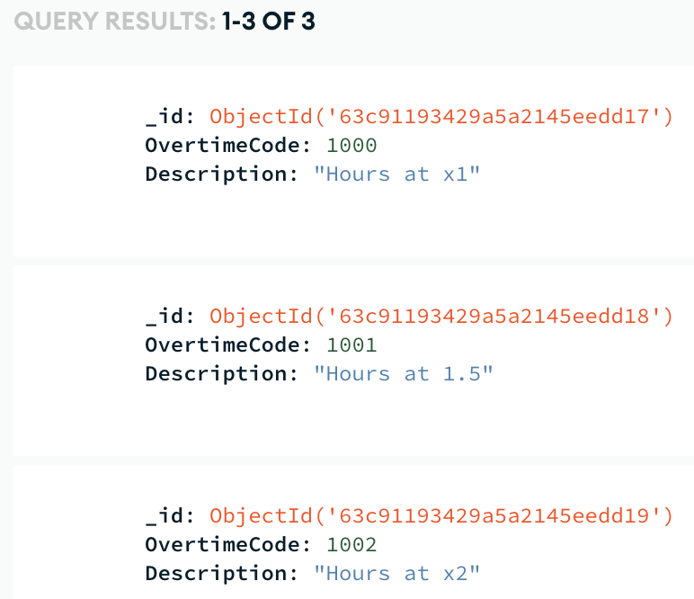
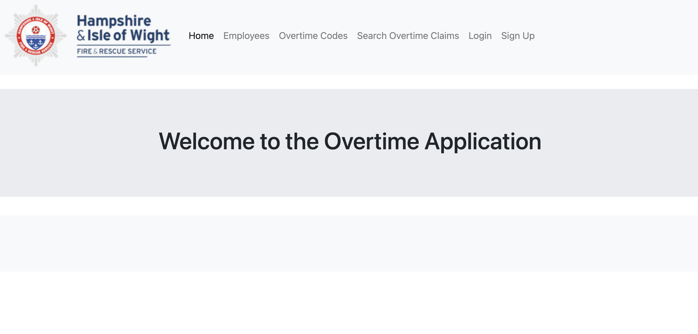
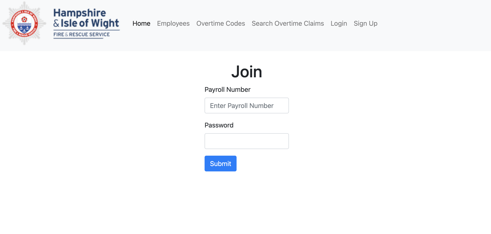
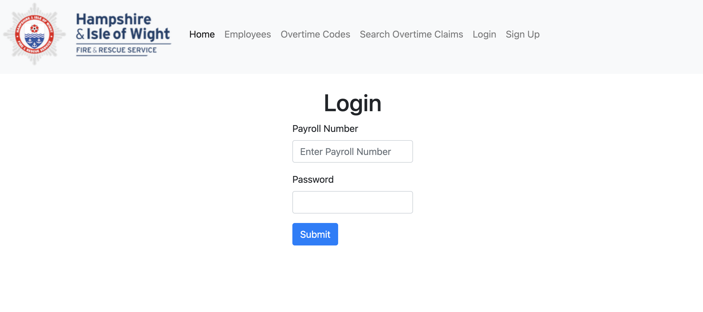
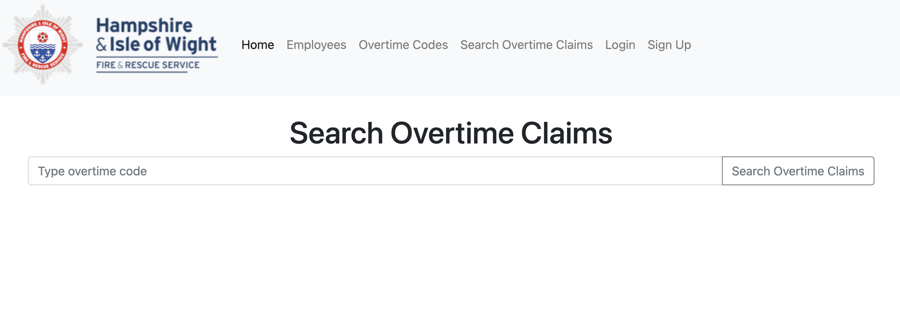

# COM519 - Advanced Databases

<u>Database:</u>  
https://account.mongodb.com/account/login 

Email Address:  
5duddl71@solent.ac.uk  

Password:  
1GreenBanana!  

<u>Web Address:</u>  
https://pear-vast-cheetah.cyclic.app

<u>Git Repository:</u>  
https://github.com/AmeChops/Assessment.git

## Introduction

Within Hampshire & Isle of Wight Fire and Rescue Service there is currently no auotmated process for claiming overtime.  These are currently recorded using paper forms and spreadsheets.  This can casue delays to claims and increases possibilties for errors due to manual intervention.  This web application should provide a more robust way of claiming making it quicker and less prone to errors caused by manual intervention.

## System Overview

I have used a Mongo Atlas database to hold the information.

Employees will login with their user name, this will be their Payroll Number.  The progress that I have made on the system is that you are able to add a new user.  For the purpose of this application I have pre-loaded three types of overtime codes in to the database as shown here:

Front page:

Sign-up page:

Login page:

Search overtime code page:

## Database Design

The database consists of 3 tables; Employee, Overtime and Overtime Claims.

- The Employee table hold information relating to employees.
- The Overtime table holds information relating to overtime codes.
- The Overtime Claims table holds information on the overtime that has been claimed by employees.

Please see the below entity relationship diagram which shows hows the tables link together.

## Security and Scalability

By hashing the passwords I have created a level of security which will make the system less open to hacking.  As it it hosted in a cloud environment scalability is an option to allow for storing more data.

If I were to implement this within my workplace I would have chosen to store the data within an SQL database and the whole application would be sat on internal servers and protected by the organisitions firewall and security settings.

## Conclusion

I have been able to succesfully connect the application to the database, deploy the application and implement the creation of a new employee (this does not appear to work through cyclic but does work if running from local host).  Unfortunately I have not been able to make much more progress.

I had no prior knowledge of CSS, JavaScript or Node.JS and little exposure to HTML.  I have found this module very interesting though and look forward to continuing my learning of these languages and technologies.

Ideally I would have liked to produce a full application whereby employees would be able to:
- create an account - with more details such as name and department
- create new overtime claims
- view, update and delete previous claims
- log in and out successfully

and also provide a much slicker and neater front end.